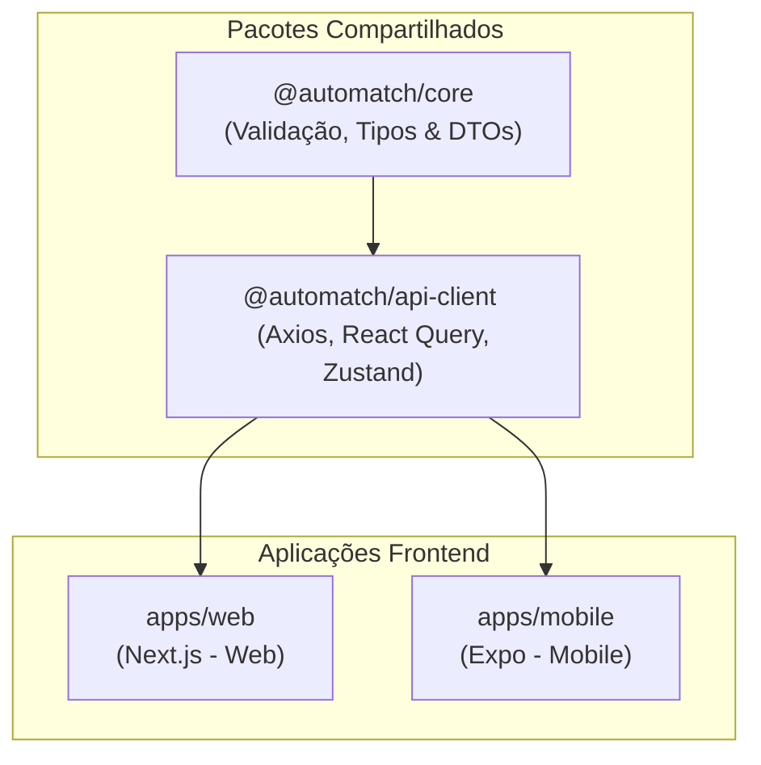

# 🤖 Guia de Agentes de IA - AutoMatch Frontend Monorepo

Este documento serve como a **especificação técnica e de diretrizes** para qualquer agente de IA (como Antigravity, Claude, Cursor, Copilot) que for ler, modificar ou estender a base de código do frontend do **AutoMatch**. 

Ele alinha a estrutura do monorepo com as regras acadêmicas do **Projeto Integrador (PI) 2026/1 - Faculdade SENAI FATESG** (detalhado no documento [PI20261-ENG6.pdf](file:///Users/danieldouglas/bits/code/fatesg/pi/automatch-frontend/docs/PI20261-ENG6.pdf)) e a arquitetura do backend de microserviços em Java.

---

## 📌 1. Visão Geral do Projeto & Arquitetura

O AutoMatch é um ecossistema projetado sob o modelo de **Monorepo** utilizando as seguintes tecnologias:
* **Orquestrador:** Turborepo ([turbo.json](file:///Users/danieldouglas/bits/code/fatesg/pi/automatch-frontend/turbo.json)) para otimização de build, cache inteligente e execução concorrente.
* **Gerenciador de Dependências:** `pnpm` v9+ com Workspaces configurados em [pnpm-workspace.yaml](file:///Users/danieldouglas/bits/code/fatesg/pi/automatch-frontend/pnpm-workspace.yaml).
* **Stack Principal:** React 19, Next.js 16 (para Web), Expo 56 e React Native 0.85 (para Mobile) com TypeScript estrito.

### 🏗️ Estrutura de Diretórios e Fluxo de Reaproveitamento

Sempre siga a regra de ouro do reaproveitamento: **Toda lógica que não seja acoplada a componentes visuais de uma plataforma específica deve ser extraída para os pacotes compartilhados.**



#### 📁 Pacotes Compartilhados (`packages/`)
* **[`@automatch/core`](file:///Users/danieldouglas/bits/code/fatesg/pi/automatch-frontend/packages/core/package.json):** Centraliza tipagem TypeScript e validação com **Zod**. Qualquer contrato que espelhe os DTOs do backend deve ser declarado aqui.
* **[`@automatch/api-client`](file:///Users/danieldouglas/bits/code/fatesg/pi/automatch-frontend/packages/api-client/package.json):** Contém a instância base do Axios configurada, interceptores globais para controle de sessões e tokens JWT, além dos React Query hooks e stores Zustand compartilhados.

#### 📁 Aplicações (`apps/`)
* **[`apps/web`](file:///Users/danieldouglas/bits/code/fatesg/pi/automatch-frontend/apps/web/package.json):** Next.js 16 com TailwindCSS v4. Foco em SEO, renderização híbrida (SSR/ISR) e design responsivo.
* **[`apps/mobile`](file:///Users/danieldouglas/bits/code/fatesg/pi/automatch-frontend/apps/mobile/package.json):** Expo 56 executando React Native 0.85. Foco em interfaces táteis nativas e persistência de credenciais segura.

---

## 🔗 2. Integração com o Backend & VPS

O backend oficial é composto por microserviços Java 21 / Spring Boot 3.2.5 (localizados na pasta [automatch-backend](file:///Users/danieldouglas/bits/code/fatesg/pi/automatch-frontend/automatch-backend)). O ponto de entrada principal para o frontend é o **API Gateway** centralizado, acessível em ambiente local e em produção na **VPS**.

### 🌐 Configuração de Ambiente
As URLs de endpoint devem ler dinamicamente as variáveis de ambiente das respectivas plataformas:
* **Web (Next.js):** Utiliza `NEXT_PUBLIC_API_URL`
* **Mobile (Expo):** Utiliza `EXPO_PUBLIC_API_URL`

### 🔑 Autenticação e Interceptores
* O IAM Service (`iam-service`) emite tokens JWT na rota `/api/v1/auth/login`.
* O client HTTP localizado em [packages/api-client/src/api.ts](file:///Users/danieldouglas/bits/code/fatesg/pi/automatch-frontend/packages/api-client/src/api.ts) deve injetar automaticamente o cabeçalho `Authorization: Bearer <token>` em requisições seguras.
* No Mobile, a persistência utiliza `expo-secure-store`. Na Web, utiliza `localStorage`/`cookies`. Ambos devem sincronizar com a store Zustand.

#### 🗂️ Mapeamento de Endpoints do Backend (Spring Boot)
1. **Autenticação (`iam-service` na porta 8081 / via Gateway):**
   * `POST /api/v1/auth/register` (Registra um novo usuário com perfil `CLIENT` ou `MECHANIC`).
   * `POST /api/v1/auth/login` (Realiza login e retorna token JWT em `AuthResponse`).
2. **Catálogo (`catalog-service` na porta 8082 / via Gateway):**
   * `GET /api/v1/professionals/search?specialty={specialty}` (Busca profissionais no catálogo cacheado em Redis).
   * `PUT /api/v1/professionals/{id}` (Atualiza perfil profissional do mecânico/oficina).
3. **Agendamento (`booking-service` na porta 8083 / via Gateway):**
   * `POST /api/v1/bookings` (Cria uma reserva de serviço garantindo idempotência).

---

## 🎨 3. Requisitos de UI/UX e IHC (Interação Humano-Computador)

De acordo com as diretrizes da disciplina de **IHC** contidas na especificação do projeto, a interface gráfica deve seguir padrões rigorosos de design premium:
1. **Acessibilidade & Cores:** Evitar cores puras e genéricas. Utilizar paletas modernas (como cores neutras e profundas do Tailwind, escalas HSL e dark mode elegante por padrão).
2. **Tipografia Premium:** Usar fontes do Google Fonts (Inter, Roboto ou Outfit) com hierarquização correta (H1 único, pesos de fonte proporcionais).
3. **Micro-interações:** Adicionar feedback tátil e visual em hovers, botões de ação e estados de carregamento (Skeletons elegantes e spinners modernos).
4. **Sem Placeholders:** Imagens ou logos devem ser gerados de forma ativa ou representados por ícones vetoriais modernos (React Icons ou Lucide).

---

## 📐 4. Análise de Complexidade & Algoritmos

A disciplina de **Análise e Projeto de Algoritmos** exige a documentação de **5 funções core** com cálculo matemático de sua complexidade $T(n)$ e a identificação de uma técnica de projeto de algoritmos empregada. 
Como agente, garanta que:
* As funções de ordenação de profissionais (ex: por avaliação ou distância) e busca textual implementem algoritmos eficientes e bem-comentados.
* Algoritmos de paginação, busca binária no catálogo ou ordenação rápida sejam destacados para análise no relatório acadêmico.

---

## 🤖 5. Protocolo de Modificação do Código para Agentes

Ao alterar ou criar novos arquivos, siga rigorosamente este fluxo:

```
1. Declarar/Alterar Zod Schema em @automatch/core/src
               ↓
2. Gerar/Atualizar Tipos TypeScript Correspondentes
               ↓
3. Escrever o Serviço/Hook no @automatch/api-client/src
               ↓
4. Importar e Renderizar na UI em apps/web ou apps/mobile
```

### 🚨 Regras Críticas
1. **Nunca use `any`.** Utilize tipos genéricos ou declarações estritas.
2. **Preservar Comentários e Assinaturas.** Nunca exclua comentários explicativos antigos que descrevem o comportamento de rotas, DTOs e funções.
3. **Padrão de Erros Rastreável.** O backend retorna um `traceId` em respostas com erro (gerado via Micrometer Tracing no API Gateway). Na UI, trate as exceções mostrando este ID de forma amigável ao usuário para facilitar o rastreamento em produção.

---

## 💻 6. Guia Rápido de Comandos

Aqui está o sumário de comandos úteis para o monorepo utilizando `pnpm`:

### Desenvolvimento Local Concorrente (Web + Mobile + API Client)
```bash
pnpm dev
```

### Executar comandos em aplicações específicas
* **Somente Web (Next.js):**
  ```bash
  pnpm --filter web dev
  ```
* **Somente Mobile (Expo):**
  ```bash
  pnpm --filter mobile start
  ```
* **Compilar pacotes compartilhados (se alterados):**
  ```bash
  pnpm --filter @automatch/api-client build
  ```

### Docker e Execução em Produção (VPS)
* **Construir Imagem Docker localmente:**
  ```bash
  docker build --build-arg NEXT_PUBLIC_API_URL=http://187.124.128.145:8080/api/v1 -t automatch-web-app .
  ```
* **Gerenciar container do Frontend via Docker Compose:**
  ```bash
  docker compose -p automatch-web-prod -f docker-compose.frontend.yml up -d
  docker compose -p automatch-web-prod -f docker-compose.frontend.yml down
  ```

### Qualidade de Código (Lint e Type check)
```bash
pnpm lint
pnpm clean
```

