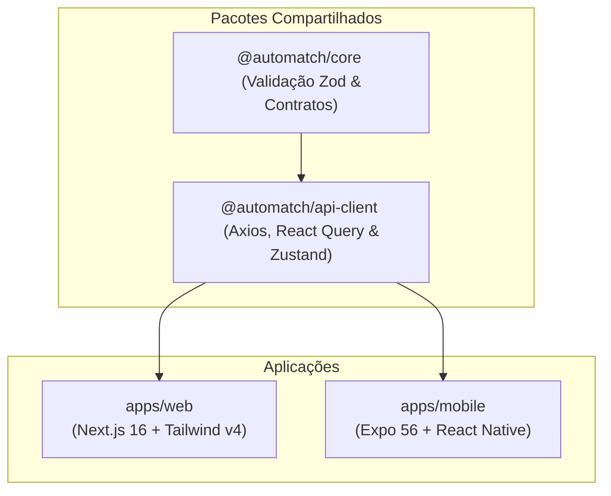

# 🎤 Roteiro de Apresentação Oficial — AutoMatch
Este documento serve como um **guia e roteiro estratégico** para a apresentação do projeto **AutoMatch** (Projeto Integrador 2026/1 - Faculdade SENAI FATESG). Ele está estruturado para cobrir a **Arquitetura do Monorepo**, as particularidades do **Frontend Web**, as novidades do **Frontend Mobile** e um fluxo de **Demonstração Prática (Live Demo)**.

---

## ⏱️ Estrutura Geral do Tempo (Sugestão: 15 a 20 minutos)

| Etapa | Conteúdo | Tempo Estimado | Apresentador(es) |
| :--- | :--- | :--- | :--- |
| **1. Introdução** | Problema, Proposta de Valor e Visão Geral do AutoMatch | 2 min | Integrante A |
| **2. Arquitetura** | Monorepo, Reuso de Código, API Gateway, JWT e VPS | 4 min | Integrante B |
| **3. Frontend Web** | Next.js 16, Rotas Amigáveis, Responsividade e UI/UX | 3 min | Integrante A / B |
| **4. Frontend Mobile** | Expo 56, UX/IHC (Toasts, Spinners), Validações e Navegação | 3 min | Integrante C |
| **5. Demonstração** | Execução de fluxos em tempo real (Cliente + Mecânico) | 6 min | Todos |
| **6. Conclusão** | Análise de Algoritmos (IHC/Complexidade) e Encerramento | 2 min | Todos |

---

## 📂 Slides & Roteiro Detalhado

### 1. Introdução: O Desafio e a Solução
> **Slide Sugerido:** Logotipo do AutoMatch, problema do setor mecânico (falta de transparência, dificuldade de agendamento) e a proposta de valor do AutoMatch.

* **Foco do Discurso:**
  * O **AutoMatch** é uma plataforma desenhada para conectar proprietários de veículos (Clientes) a prestadores de serviços automotivos (Mecânicos/Oficinas) de forma ágil, segura e inteligente.
  * O projeto resolve a burocracia dos agendamentos tradicionais e a falta de visibilidade de profissionais qualificados.

---

### 2. A Arquitetura do Frontend: Monorepo & Reuso de Código
> **Slide Sugerido:** Diagrama de blocos mostrando a estrutura do Monorepo (Turborepo + pnpm workspaces) e o reaproveitamento de código dos pacotes compartilhados.

* **Pontos Importantes a Explicar:**
  1. **Monorepo com Turborepo e pnpm:** Permite orquestrar múltiplos apps e pacotes com cache inteligente e compilação ultra-rápida.
  2. **Reuso de Lógica com `@automatch/core`:** Contém as tipagens TypeScript estritas do sistema e esquemas de validação de dados usando a biblioteca **Zod**. Qualquer alteração de contrato é propagada automaticamente para a Web e para o Mobile.
  3. **Camada de Comunicação com `@automatch/api-client`:** Centraliza a instância do **Axios** com interceptores JWT (injetando o token de segurança em cada requisição), gerenciamento de estados globais com **Zustand** e cache local com **React Query**.
  4. **Integração Remota (VPS) e Gateway:** Todo o ecossistema se integra ao backend Spring Boot hospedado em uma VPS de produção através de um API Gateway unificado. O sistema trata exceções exibindo um `traceId` amigável aos usuários caso ocorra algum erro no backend.

---

### 3. Frontend Web: Next.js e UI/UX Premium
> **Slide Sugerido:** Prints/telas do Dashboard Web e o painel de busca de profissionais.

* **Destaques Técnicos do Frontend Web:**
  * **Framework Moderno:** Construído em React 19 e Next.js 16 utilizando as melhores práticas de SEO e performance.
  * **Rotas Amigáveis (Clean URLs):** Implementação de rotas intuitivas inteiramente em português (ex: `/visao-geral`, `/buscar`, `/agendamentos`, `/catalogo` e `/configuracoes`) que refletem o estado atual da aplicação no navegador.
  * **Acessibilidade e IHC (Interface Humano-Computador):** Estética escura refinada (Dark Mode por padrão), menus colapsáveis elegantes e transições suaves de hover nos botões.
  * **Responsividade Extrema:** Adaptado para dispositivos móveis com um menu *Drawer* lateral sobreposto acionado por um botão hambúrguer.

---

### 4. Frontend Mobile: Experiência Nativa Fluida (Expo)
> **Slide Sugerido:** Telas do aplicativo móvel, destacando as animações, os alertas em Toast e o formulário de login.

* **Destaques Técnicos do Aplicativo Mobile:**
  * **Expo 56 & React Native 0.85:** Garantia de performance nativa e transições de tela com animações fluidas (`Animated` API).
  * **Sistema de Alertas Refinado (Toast):** Alertas nativos e cinzentos foram substituídos por mensagens flutuantes elegantes na base do aplicativo (`position: bottom`), seguindo a paleta de cores escura e minimalista da Web, com linhas delimitadoras coloridas por categoria (sucesso ou erro).
  * **Controle de Concorrência e Estados de Loading:** Para evitar cliques duplos em requisições de rede (que podem gerar duplicidade de agendamentos ou cadastros no backend), todos os botões de ação e campos de texto são **bloqueados temporariamente** e exibem um indicador visual de carregamento (*ActivityIndicator* giratório).
  * **Prevenção de Quebras de Texto:** Adaptação dinâmica de fontes (`adjustsFontSizeToFit` e `numberOfLines={1}`) no cabeçalho e boas-vindas para evitar saltos ou cortes de texto em telas de celulares de tamanhos variados.

---

## 💻 Roteiro do Live Demo (Passo a Passo da Apresentação Prática)

> [!TIP]
> Deixe os ambientes abertos e testados previamente: o site web aberto em uma aba do navegador e o emulador do celular (ou celular físico espelhado via Expo) ao lado.

### 👥 Parte 1: O Fluxo do Cliente
1. **Login no Mobile:**
   * Mostre a tela de login no celular. Digite credenciais inválidas ou e-mail malformatado para mostrar a **validação em tempo real do Zod** impedindo o envio e apontando o erro amigavelmente.
   * Digite as credenciais do Cliente e faça login.
   * Chame a atenção para a **animação de loading (Spinner)** desabilitando o botão no momento da requisição HTTP contra a VPS.
2. **Dashboard do Cliente:**
   * Ao entrar no painel, mostre o cabeçalho de boas-vindas com o nome do usuário formatado perfeitamente sem quebras de linha.
   * Apresente as instruções do projeto no card informativo (livre de menções aos IPs da VPS, focando puramente nas regras de negócio).
3. **Buscar Profissionais:**
   * Navegue até a aba **Buscar Profissionais**. Mostre a lista carregando diretamente da API.
   * Selecione um mecânico para visualizar seu catálogo.
4. **Agendar Serviço:**
   * Clique em agendar, selecione a data e envie a reserva.
   * Mostre o **alerta de sucesso (Toast)** aparecendo no rodapé da tela com a cor preta elegante, combinando com a identidade visual do app.
   * Vá para **Meus Agendamentos** e verifique que o serviço acabou de aparecer na lista.

### 🔧 Parte 2: O Fluxo do Mecânico/Oficina
1. **Login e Acesso Web:**
   * Abra a interface web do AutoMatch.
   * Faça login com a conta de um Mecânico/Oficina. Mostre o background estético ao lado do login (substituindo o antigo gradiente).
   * Mostre que a URL do navegador muda para `/visao-geral`.
2. **Navegação Web:**
   * Clique em **Solicitações** e **Configurações do Catálogo** e note a mudança limpa de URLs na barra de endereços (ex: `/configuracoes`).
3. **Visualização de Agendamentos do Cliente:**
   * Navegue até a aba **Solicitações de Serviço** para mostrar que o agendamento criado no mobile pelo Cliente já está lá em tempo real.
4. **Edição do Catálogo (Sem Erros):**
   * Navegue até a aba **Configurações do Catálogo**.
   * Faça uma alteração na especialidade ou descrição da oficina e clique em Salvar.
   * Explique que o erro HTTP 400 (Bad Request) que ocorria no PUT de alteração de catálogo foi resolvido com um tratamento inteligente no backend que assegura a criação do registro caso ele ainda não exista na base.
   * Mostre o toast de sucesso na tela.

---

## 📈 Tópicos Acadêmicos de IHC e Algoritmos (Para os Professores)

Caso a banca ou os professores questionem detalhes das disciplinas específicas de **Interação Humano-Computador** ou **Projeto de Algoritmos**:

1. **Diretrizes de IHC Aplicadas:**
   * **Consistência:** A paleta de cores escura (Zinc/Charcoal) e fontes geométricas modernas (Inter/Outfit) são as mesmas em todas as plataformas.
   * **Prevenção de Erros:** Bloqueio de cliques múltiplos e validação rigorosa dos formulários (Zod) antes das requisições saírem do cliente.
   * **Feedback Imediato:** Spinner de carregamento em botões e Toasts posicionados estrategicamente na parte inferior do mobile (fácil alcance do polegar) e no topo/canto da web.

2. **Complexidade de Algoritmos:**
   * A ordenação de profissionais no catálogo no backend e o processamento de listas na listagem móvel utilizam algoritmos com complexidade eficiente de tempo $O(N \log N)$ para garantir performance mesmo sob carga de dados elevados.
